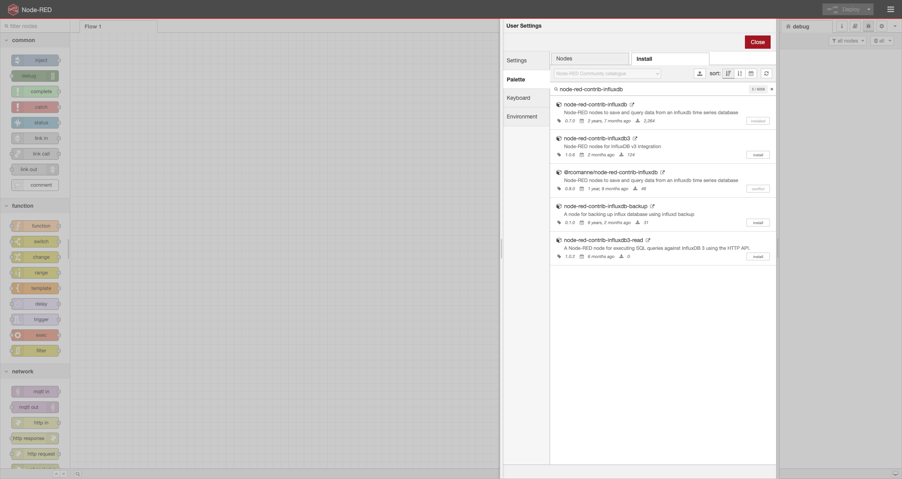
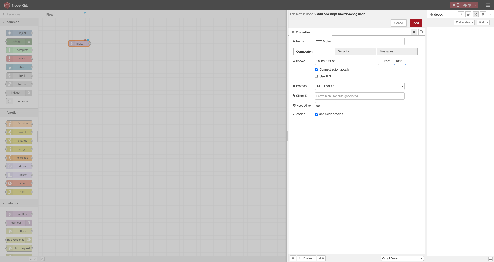
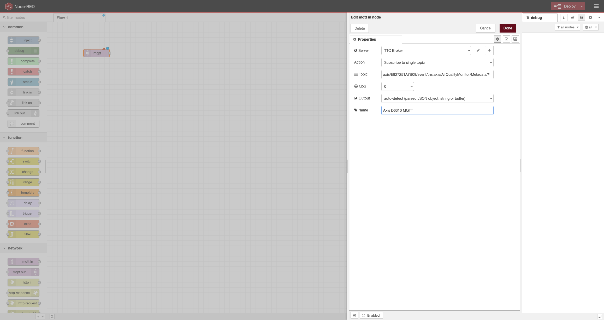
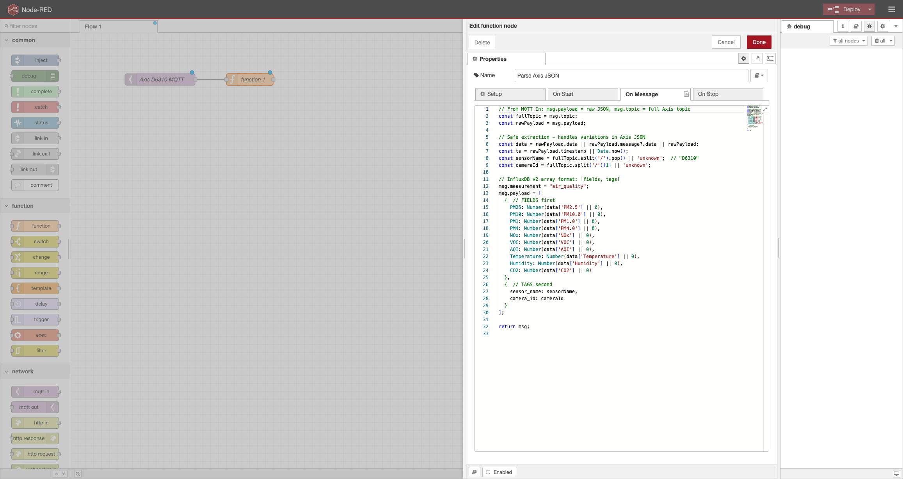
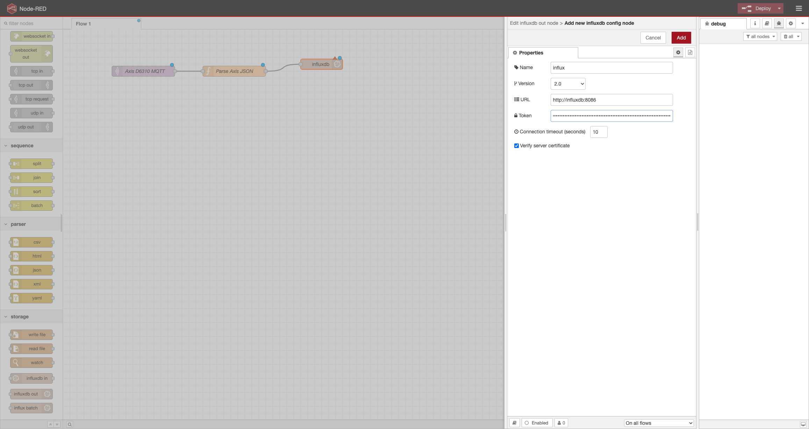
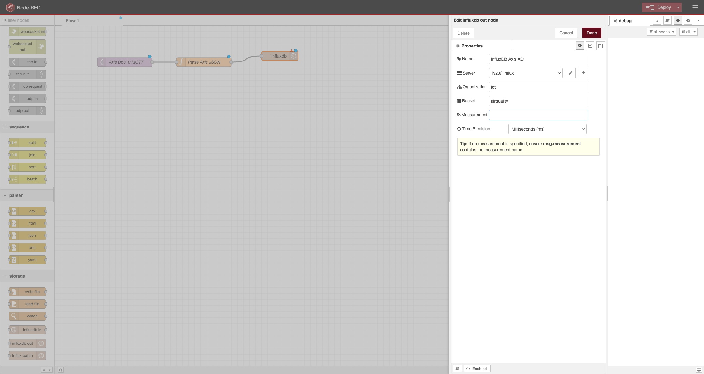
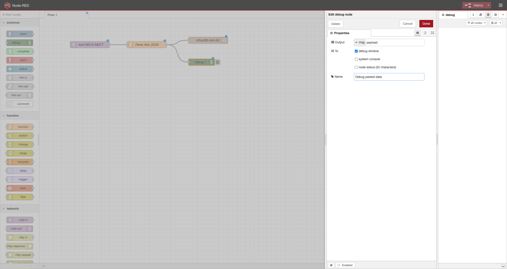
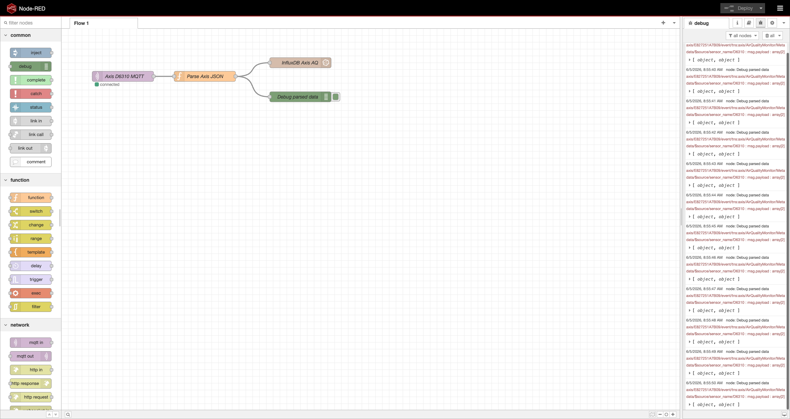
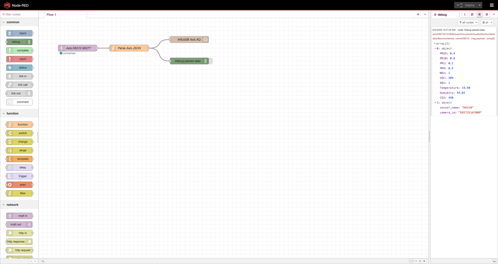

# Axis D6310 Air Quality M.I.N.G Stack

Docker Compose **M.I.N.G** stack (MQTT, InfluxDB, Node-RED, Grafana) for **AXIS D6310** air quality sensor.  
Ingest MQTT data, visualize in Grafana. Perfect for smart buildings/IoT.

---

## What This Stack Does


AXIS D6310 (Sensor) -> MQTT (Transmits) -> Node-RED (Transforms) -> InfluxDB (Stores) -> Grafana (Dashboard)


### Components Explained

| Component | Role | Why It Matters |
|-----------|------|----------------|
| **AXIS D6310** | Air quality sensor (temp, humidity, VOC, CO2, PM, AQI) | Publishes real-time environmental data via MQTT |
| **MQTT Broker (Mosquitto)** | Message bus | Lightweight pub/sub for sensor data and alerts |
| **Node-RED** | Data pipeline | Subscribes to MQTT, transforms JSON, writes to InfluxDB |
| **InfluxDB** | Time-series database | Stores all measurements with timestamps for querying |
| **Grafana** | Visualization & alerting | Builds dashboards, monitors thresholds, sends MQTT alerts |

---

## Features
- Simple Docker Compose
- Node-RED MQTT flows (Axis → Influx)
- Grafana dashboard setup guide

## Prerequisites
- Docker 
- AXIS D6310 sensor(s)
- Git for windows

### Deploy the Stack

***Windows***
1. Install [Docker](https://docs.docker.com/desktop/setup/install/windows-install/) and [Git](https://git-scm.com/install/windows) ***(For the TTC workshop they are already installed on the workstation)***
2. Clone the repo ```git clone https://github.com/Axis-TTC/Axis_AQS_Data_Visualization```
3. ```cd Axis_AQS_Data_Visualization```
4. ```docker-compose -f docker-compose.ming.yml up -d```
   
***Linux***
1. Install [Docker](https://docs.docker.com/engine/install/)
2. ```sudo apt install docker-compose```
3. ```mkdir -p axis-aqs && cd axis-aqs```
4. ```nano docker-compose.yml```
5. Paste content of [docker-compose.ming.yml](https://github.com/Axis-TTC/Axis_AQS_Data_Visualization/blob/main/docker-compose.ming.yml)
6. Save and exit (control + x)
7. ```sudo docker-compose up -d```

### Access Services

| Service | URL | Credentials |
|---------|-----|-------------|
| **Grafana** | http://localhost:3000 | `admin` / `password123` |
| **Node-RED** | http://localhost:1880 | (none) |
| **InfluxDB** | http://localhost:8086 | `admin` / `password123` |
| **MQTT Broker** | tcp://localhost:1883 | (none) |

---

## Configuration

### 1. Configure AXIS D6310 Sensor

**What happens:** Sensor publishes air quality data to MQTT every second.

***For the TTC workshop the D6310's are already configured, skip to [2. Configure Node-RED Flow](https://github.com/Axis-TTC/Axis_AQS_Data_Visualization#2-configure-node-red-flow)***
1. Update Firmware to latest
2. Configure MQTT `http://camera-ip/environmental-sensor/index.html#/system/mqtt/publication`
   - Host: your computers IP
   - **Save** → **Connect**
5. **+ Add Condition**
   - Condition: Air quality monitoring active (this starts publishing air quality data every second)
   - **Add**
8. Take note of device serial for next step

---

### 2. Configure Node-RED Flow

**What happens:** Node-RED subscribes to sensor MQTT topics, parses messages, writes structured data to InfluxDB.

The flow you will build looks like this:

```
[MQTT in: Axis D6310 MQTT] ──► [Function: Parse Axis JSON] ──┬──► [InfluxDB out: InfluxDB Axis AQ]
                                                              └──► [Debug: Debug parsed data]
```

**TTC Sensors (already publishing to 10.129.174.38:1883)**  
D6310 Play Space: `E827251A7B8B`  
D6310 Learn Space: `E827251A7B09`  
D6310 Server Rack: `E827251AA4C6`  
D6310 Entrance: `E827251A8AF7`

---

#### 2.1 Open Node-RED and install the InfluxDB palette

The default Node-RED image does not ship with the InfluxDB output node, so you need to add it once.

1. Open Node-RED: http://localhost:1880
2. Top right burger menu (☰) → **Manage palette**
3. Select the **Install** tab
4. Search for `node-red-contrib-influxdb`
5. Click **install** next to the matching entry → confirm **Install**
6. Wait for the green "added nodes" message, then **Close**



---

#### 2.2 Add and configure the MQTT in node

This node subscribes to one sensor's MQTT topic.

1. From the **network** category in the left palette, drag a **mqtt in** node onto the workspace
2. Double click the node to open its config panel
3. **Server** field → click the pencil (✎) to create a new broker
   - **Name:** `TTC Broker`
   - **Server:** `10.129.174.38` ***(for the TTC workshop)***
     - If you are running everything locally instead, use `mosquitto`
   - **Port:** `1883`
   - Leave everything else at its default
   - Click **Add**



4. **Action:** `Subscribe to single topic`
5. **Topic:** `axis/<SERIAL>/event/tns:axis/AirQualityMonitor/Metadata/#`
   - Replace `<SERIAL>` with your assigned TTC sensor serial from the list above
   - Example for the Learn Space sensor: `axis/E827251A7B09/event/tns:axis/AirQualityMonitor/Metadata/#`
6. **QoS:** `0`
7. **Output:** `auto-detect (parsed JSON object, string or buffer)`
8. **Name:** `Axis D6310 MQTT`
9. Click **Done**



---

#### 2.3 Add and configure the Parse Axis JSON function node

This node reshapes the raw Axis JSON into the array format the InfluxDB out node expects (`[fields, tags]`).

1. From the **function** category, drag a **function** node onto the workspace, to the right of the MQTT in node
2. Double click to open it
3. **Name:** `Parse Axis JSON`
4. Select the **On Message** tab
5. Replace any starter code with the block below

What this code does:
- Reads `msg.payload` (the parsed Axis JSON) and `msg.topic` (the full MQTT topic)
- Pulls the sensor serial out of the topic so it can be stored as a tag
- Builds the two-element array InfluxDB v2 expects: fields first (the numeric measurements), tags second (`sensor_name`, `camera_id`)
- Sets `msg.measurement = "air_quality"` so all rows land in the same measurement

```js
// From MQTT In: msg.payload = raw JSON, msg.topic = full Axis topic
const fullTopic = msg.topic;
const rawPayload = msg.payload;

// Safe extraction - handles variations in Axis JSON
const data = rawPayload.data || rawPayload.message?.data || rawPayload;
const ts = rawPayload.timestamp || Date.now();
const sensorName = fullTopic.split('/').pop() || 'unknown';  // "D6310"
const cameraId = fullTopic.split('/')[1] || 'unknown';

// InfluxDB v2 array format: [fields, tags]
msg.measurement = "air_quality";
msg.payload = [
  {  // FIELDS first
    PM25: Number(data['PM2.5'] || 0),
    PM10: Number(data['PM10.0'] || 0),
    PM1: Number(data['PM1.0'] || 0),
    PM4: Number(data['PM4.0'] || 0),
    NOx: Number(data['NOx'] || 0),
    VOC: Number(data['VOC'] || 0),
    AQI: Number(data['AQI'] || 0),
    Temperature: Number(data['Temperature'] || 0),
    Humidity: Number(data['Humidity'] || 0),
    CO2: Number(data['CO2'] || 0)
  },
  {  // TAGS second
    sensor_name: sensorName,
    camera_id: cameraId
  }
];

return msg;
```

6. Leave **Outputs** at `1`
7. Click **Done**
8. Wire the MQTT in node's output port to the function node's input port (click and drag from the small grey square on the right of the MQTT node to the one on the left of the function node)



---

#### 2.4 Generate an InfluxDB API token

The InfluxDB out node needs a token to authenticate.

1. In a new tab open InfluxDB: http://localhost:8086 ( `admin` / `password123` )
2. Left sidebar → **Load Data** → **API Tokens**
3. **Generate API Token** → **All Access API Token**
4. **Description:** `nodered`
5. Click **Save**
6. Click the token you just created to reveal it
7. Select the token text and copy it manually with `Ctrl+C` (**DO NOT CLICK** the "copy to clipboard" button, it does not always work)

Keep this tab open, you will need it again for Grafana later.

---

#### 2.5 Add and configure the InfluxDB out node

This node writes each parsed message into the `airquality` bucket.

1. Back in Node-RED, from the **storage** category, drag an **influxdb out** node onto the workspace, to the right of the function node
2. Double click to open it
3. **Server** field → click the pencil (✎) to create a new InfluxDB connection
   - **Version:** `2.0 Flux`
   - **URL:** `http://influxdb:8086`
   - **Token:** paste the token you copied in 2.4
   - **Organization:** `iot`
   - **Name:** `influx`
   - Click **Add**



4. Back on the node settings:
   - **Organization:** `iot`
   - **Bucket:** `airquality`
   - **Measurement:** leave **blank** (the function node sets it via `msg.measurement`)
   - **Name:** `InfluxDB Axis AQ`
5. Click **Done**
6. Wire the function node's output to the InfluxDB out node's input



---

#### 2.6 Add a Debug node

This lets you see parsed messages in the right-hand debug sidebar so you can confirm data is flowing.

1. From the **common** category, drag a **debug** node onto the workspace, below the InfluxDB out node
2. Double click to open it
3. **Output:** `msg.payload`
4. **To:** tick **debug window**
5. **Name:** `Debug parsed data`
6. Click **Done**
7. Wire the function node's output to the debug node's input as well (the function node output can drive both the InfluxDB out and the debug node)



---

#### 2.7 Deploy and verify

1. Click the red **Deploy** button in the top right
2. Under each node you should see a small green dot with `connected`
3. Open the **debug** sidebar (the bug icon on the right)
4. Within a few seconds you should see parsed payload objects appearing with `PM25`, `CO2`, `Temperature`, `Humidity`, etc.



Expand a debug message to confirm the parsed fields and tags:



If nothing appears:
- Re-check the topic serial matches your assigned sensor
- Re-check the broker host (`10.129.174.38` for the workshop)
- Re-check the InfluxDB token, organization (`iot`), and bucket (`airquality`)

---

#### 2.8 Duplicate the MQTT in node for the other TTC sensors

To ingest from all four TTC sensors, you only need to duplicate the MQTT in node, not the rest of the flow.

1. Click the **Axis D6310 MQTT** node to select it
2. Press `Ctrl+C` then `Ctrl+V` (or right click → **Copy**, then **Paste**) to create a copy
3. Double click the new node and change only the serial in **Topic** to the next sensor from the list
4. Click **Done**
5. Wire the new node's output to the existing **Parse Axis JSON** function node
6. Repeat for the remaining sensors so you have four MQTT in nodes, all feeding the same Parse Axis JSON node
7. Click **Deploy**

---

#### Fallback: import the prebuilt flow

If you fall behind, you can import the finished flow instead and just update the broker and InfluxDB token.

1. Top right burger menu (☰) → **Import**
2. Paste the contents of [aqs_to_influx.json](https://github.com/Axis-TTC/Axis_AQS_Data_Visualization/blob/main/aqs_to_influx.json) and click **Import**
3. Update the MQTT broker host and topic serials, and the InfluxDB token, as described in 2.2 and 2.5 above
4. Click **Deploy**

---

### 3. Verify Data in InfluxDB

**What happens:** Check that sensor data is being written to the time-series database.

1. Open InfluxDB: http://localhost:8086 ( `admin` / `password123` )
2. On the left side click **Data Explorer**
   - Select **airquality**
   - Tick **air_quality**
   - Tick one of the data types eg. AQI or CO2
   - Select **Past 1h** from the drop down
7. You should see data plotted

**No data?** Check Node-RED debug panel and MQTT configuration.

---

## Build Grafana Dashboard

### Add InfluxDB Data Source

**What happens:** Connect Grafana to InfluxDB so it can query and visualize data.

1. Open InfluxDB: http://localhost:8086 ( `admin` / `password123` )
2. Click **Load Data** → **API Tokens** → **Generate API Token** → **All Access API Token**
    - Name it `grafana`
    - Copy the token (**DO NOT CLICK** "copy to clipboard" it doesnt always work)
3. Open Grafana: http://localhost:3000 ( `admin` / `password123` )
4. **Connections** → **Data Sources** → **Add data source** → **InfluxDB**
   - Query language: Flux
   - URL: `http://influxdb:8086`
   - User: `admin`
   - Password: `password123`
   - Organization: `iot`
   - Paste the InfluxDB Token in **Token** field
13. **Save & Test**

---

### Create Dashboard Panels

**What happens:** Build visual panels that query InfluxDB and plot metrics over time.

1. In Grafana click **Dashboards** → **Create dashboard** → **Add visualization**
3. Select **InfluxDB**

### Temperature

1. Click **Back** near the top right corner
- Title: `Temperature`
- Unit: Temperature → Celsius (°C)
- Paste below into query field

```
from(bucket: "airquality")
  |> range(start: v.timeRangeStart, stop: v.timeRangeStop)
  |> filter(fn: (r) => r._measurement == "air_quality")
  |> filter(fn: (r) => r.sensor_name == "D6310")
  |> filter(fn: (r) => r._field == "Temperature")
  |> aggregateWindow(every: 1m, fn: mean, createEmpty: false)
```

**Understanding the Query:**
- `from(bucket: "airquality")` → Select the database
- `range()` → Time window from Grafana picker
- `filter(_measurement)` → Which table (air_quality)
- `filter(sensor_name)` → Which device
- `filter(_field)` → Which metric (Temperature, CO2, etc.)
- `aggregateWindow()` → Average values per minute (reduces noise)

### Increase Query Data Points (this allows displaying more than one day of data).
- Click **Query options** and change **Max data points** to `5000` 
  
### To rename the sensors
1. On the right hand side scroll all tha way to the bottom.
2. Click **+ Add field override**
3. Select **Fields with name matching regex** and use the regex ```.*camera_id="E827251A7B09".*``` to match only to the serial of the device.
4. Click **+ Add override property**
5. Select **Standard options > Display name**
6. Type the new name for the sensor
7. Repeat for other sensors

Play Space: E827251A7B8B  
Learn Space: E827251A7B09  
Server Rack: E827251AA4C6  
Entrance: E827251A8AF7  

- Click **Save Dashboard**
- Change the Dashboard **Title** to `Air Quality`
- Click **Save**
- Click **Back to dashboard**

---
  
### Humidity

1. Click the three dots in the top right of the **Tempreture** panel you just created
2. Select **More** then **Duplicate**
3. Click the three dots at the top right of the new panel that appears then select **Edit**

- Title: `Humidity`
- Unit: Misc → Percent (0-100)
- Paste below into query field

```
from(bucket: "airquality")
  |> range(start: v.timeRangeStart, stop: v.timeRangeStop)
  |> filter(fn: (r) => r._measurement == "air_quality")
  |> filter(fn: (r) => r.sensor_name == "D6310")
  |> filter(fn: (r) => r._field == "Humidity")
  |> aggregateWindow(every: 1m, fn: mean, createEmpty: false)
```

- Click **Save Dashboard**
- **Back to dashboard**

---

### VOC

1. Click the three dots in the top right of the panel you just created
2. Select **More** then **Duplicate**
3. Click the three dots at the top right of the new panel that appears then select **Edit**

- Title: `VOC`
- Unit: Concentraion → parts-per-million (ppm)
- Paste below into query field

```
from(bucket: "airquality")
  |> range(start: v.timeRangeStart, stop: v.timeRangeStop)
  |> filter(fn: (r) => r._measurement == "air_quality")
  |> filter(fn: (r) => r.sensor_name == "D6310")
  |> filter(fn: (r) => r._field == "VOC")
  |> aggregateWindow(every: 1m, fn: mean, createEmpty: false)
```

- Click **Save Dashboard**
- **Back to dashboard**

---

### CO2

1. Click the three dots in the top right of the panel you just created
2. Select **More** then **Duplicate**
3. Click the three dots at the top right of the new panel that appears then select **Edit**

- Title: `CO2`
- Units: Concentraion → parts-per-million (ppm)
- Paste below into query field

```
from(bucket: "airquality")
  |> range(start: v.timeRangeStart, stop: v.timeRangeStop)
  |> filter(fn: (r) => r._measurement == "air_quality")
  |> filter(fn: (r) => r.sensor_name == "D6310")
  |> filter(fn: (r) => r._field == "CO2")
  |> aggregateWindow(every: 1m, fn: mean, createEmpty: false)
```

- Click **Save Dashboard**
- **Back to dashboard**

---

### PM1, PM2.5, PM4, PM10

1. Click the three dots in the top right of the panel you just created
2. Select **More** then **Duplicate**
3. Click the three dots at the top right of the new panel that appears then select **Edit**

- Title: `PM1, PM2.5, PM4, PM10`
- Units: Concentraion → micrograms per cubic meter (µg/m³)
- Paste below into query field

```
from(bucket: "airquality")
  |> range(start: v.timeRangeStart, stop: v.timeRangeStop)
  |> filter(fn: (r) => r._measurement == "air_quality")
  |> filter(fn: (r) => r.sensor_name == "D6310")
  |> filter(fn: (r) => r._field == "PM1" or r._field == "PM25" or r._field == "PM4" or r._field == "PM10")
  |> aggregateWindow(every: 1m, fn: mean, createEmpty: false)
```

- Click **Save Dashboard**
- **Back to dashboard**

---

### AQI

1. Click the three dots in the top right of the panel you just created
2. Select **More** then **Duplicate**
3. Click the three dots at the top right of the new panel that appears then select **Edit**

- Title: `AQI`
- Paste below into query field

```
from(bucket: "airquality")
  |> range(start: v.timeRangeStart, stop: v.timeRangeStop)
  |> filter(fn: (r) => r._measurement == "air_quality")
  |> filter(fn: (r) => r.sensor_name == "D6310")
  |> filter(fn: (r) => r._field == "AQI")
  |> aggregateWindow(every: 1m, fn: mean, createEmpty: false)
```

- Click **Save Dashboard**
- **Back to dashboard**

---

## Connect to Historical Data (Task 2)

**What happens:** Query a separate InfluxDB that has been collecting data for days/weeks to analyze trends and anomalies.

1. In Grafana: **Connections** → **Data Sources** → Edit your existing one.
2. Configure historical database:
   - URL: `http://10.129.174.38:8086`
   - Token:
```
8x91i7sURTyiLT-Sv9kK8xyoTL7GOhRjxUZRgVeaXdVh-d7GoBOcmpUZWsvd2ZQ83VzZJDkZ-jjuUVI_uigDwQ==
```
   - User: `admin` / Password: `password123`
3. **Save & Test**
4. Go back to your dashboard, change time range to **Last 7 days**
5. Look for anomalies:
   - **CO2 spikes** → High occupancy events
   - **VOC increases** → Cleaning, new materials
   - **PM spikes** → Construction, outdoor pollution events
6. **(Optional)** Review Axis camera SD card footage to correlate events with air quality changes

---

## (Bonus) Create Alerts & Axis Device Integration (Task 3) 

**What happens:** Grafana monitors thresholds and publishes MQTT alert messages that Axis devices subscribe to, triggering actions (recordings, outputs, notifications).

```
Grafana detects: VOC > 100
      ↓
Sends MQTT message to: grafana/group1/alerts
      ↓
Axis device subscribed to topic
      ↓
Triggers: Recording + Notification
```

### Step 1: Add MQTT Contact Point in Grafana

1. **Alerting** → **Contact points** → **+ Add contact point**
2. Configure:
   - Name: `MQTT Alerts`
   - Integration: **MQTT**
   - Broker URL: `tcp://10.129.174.38:1883`
   - Topic: `grafana/groupX/alerts` (replace `X` with your group number)
3. **Save contact point**

### Step 2: Create Alert Rule in Grafana

1. **Alerting** → **Alert rules** → **+ New alert rule**
2. Name: `High VOC Alert`
3. Add query (example for VOC):
```
from(bucket: "airquality")
  |> range(start: v.timeRangeStart, stop: v.timeRangeStop)
  |> filter(fn: (r) => r._measurement == "air_quality")
  |> filter(fn: (r) => r.sensor_name == "D6310")
  |> filter(fn: (r) => r._field == "VOC")
  |> aggregateWindow(every: 1m, fn: mean, createEmpty: false)
```
4. **Alert condition:**
   - Reducer: **last** (use most recent value)
   - Threshold: **is above**
   - Value: `100` (ppb for VOC)
   - You can test it by clicking **preview alert rule condition**
5. **Folder:** Create "Air Quality Alerts"
6. **Evaluation behavior:**
   - New evaluation group: "Environmental Monitoring"
   - Evaluation interval: `10s` (how often to check)
   - Pending period: `10s` (must be true for 10s before firing)
7. **Notifications:** Select your MQTT contact point
8. **Save rule and exit**

### Step 3: Test with MQTT Explorer

1. Open **MQTT Explorer** → Connect to `10.129.174.38:1883`
2. Subscribe to `grafana/groupX/alerts`
3. Trigger alert (exceed threshold or temporarily lower it)
4. Wait 1-2 minutes → Alert messages appear in MQTT Explorer

### Step 4: Configure Axis Device Event

1. Access Axis device web interface
2. **System** → **MQTT** → Connect to `10.129.174.38:1883`
3. Add MQTT subscription: `grafana/groupX/alerts`
4. **System** → **Events** → **Device events** → **Add rule**
5. Configure:
   - Trigger: **MQTT message received**
   - Topic: `grafana/groupX/alerts`
   - Action: Activate output / Record / Send notification
6. **Save** and test by triggering alert

---

## Reset

(This will delete all your dashboards and data.)

When you are done, you can remove everything with the [Reset_Workshop.bat](https://github.com/Axis-TTC/Axis_AQS_Data_Visualization/blob/main/Reset_Workshop.bat) script.

## Reference

### Recommended Alert Thresholds

| Metric | Threshold | Meaning |
|--------|-----------|---------|
| **VOC** | > 500 | Poor air quality |
| **CO2** | > 1000 ppm | Poor ventilation / high occupancy |
| **PM2.5** | > 35 µg/m³ | Unhealthy for sensitive groups |
| **Temperature** | > 26°C or < 18°C | Outside comfort zone |
| **Humidity** | > 60% or < 30% | Uncomfortable / health risk |
| **AQI** | > 100 | Unhealthy air quality |

### Troubleshooting

| Issue | Solution |
|-------|----------|
| **No MQTT data in Node-RED** | Check D6310 MQTT config, broker address, device serial in topic |
| **InfluxDB empty** | Verify bucket name `airquality`, check Node-RED InfluxDB node token |
| **Grafana shows "No data"** | Verify data source connection, check Flux query syntax |
| **Too many data points** | Increase **Max data points** to 5000-50000 in Query options |
| **Alerts don't fire** | Check threshold value, preview alert condition, ensure data is flowing |
| **Axis event doesn't trigger** | Verify MQTT subscription topic matches exactly, check event rule |
| **Historical DB unreachable** | Confirm `http://10.129.174.38:8086` is accessible, verify credentials |

---

## What You've Built

**Real-time data pipeline:** Sensor → MQTT → Node-RED → InfluxDB → Grafana  
**Historical analysis:** Multi-day trends and anomaly detection  
**Automated alerting:** Threshold monitoring with MQTT notifications  
**Device integration:** Grafana alerts trigger Axis camera events  

**Next Steps:**
- Add multiple sensors and group by location
- Create custom dashboard layouts (rows, variables, templating)
- Explore Grafana's transformation functions
- Set up different alert severities (warning/critical)
- Integrate with other systems via MQTT

---

## Developed for the Axis TTC Workshop

**⭐ Star this repo if it helped you!**
